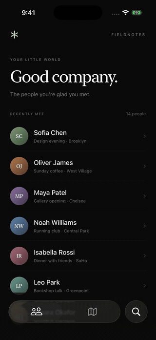

# MinimizingTabBar

A floating SwiftUI tab bar that follows your scroll and returns with a touch.

<a href="https://github.com/harivansh-afk/MinimizingTabBar/releases/latest/download/demo-x.mp4"></a>

[Watch / download the X demo](https://github.com/harivansh-afk/MinimizingTabBar/releases/latest/download/demo-x.mp4) · [Portrait recording](https://github.com/harivansh-afk/MinimizingTabBar/releases/latest/download/demo-portrait.mp4) · [Poster](media/poster.png)

Extracted from [TouchTips](https://github.com/harivansh-afk/TouchTips). A small, dependency-free component with a runnable example, not an app framework.

## The interaction

- Tracks an active drag continuously, shrinking to 85% around its bottom edge.
- Reversing direction grows the bar from its current size.
- Releasing snaps in the last meaningful drag direction.
- Touching the bar restores it while keeping the button's action.
- Switching tabs restores it. Optional back and search actions sit outside the main capsule.
- Short content stays expanded. Returning near the top restores the bar.
- Deceleration and programmatic scrolling do not drive minimization.

Uses native iOS 26 Liquid Glass and a matched-geometry selection pill. The idea of minimizing a tab bar is established; this component provides the custom layout and drag behavior outside a system `TabView`.

## Requirements

**iOS 26+, Xcode 26+, Swift 6.** No third-party dependencies, network calls, accounts, or permissions. The demo uses fictional people and places, system fonts, and SF Symbols.

## Run the demo

Open **`TabBarDemo.xcodeproj`**, select the **TabBarDemo** scheme and an iPhone simulator, then Run. The generated project is included so XcodeGen is not needed to try it.

The demo is named **Fieldnotes**. Scroll the people list, reverse direction, tap Places, open a person, and use Back or Search.

For command-line builds:

```sh
SIMULATOR_ID=$(scripts/simulator.sh)
scripts/build.sh "$SIMULATOR_ID"
scripts/test.sh "$SIMULATOR_ID"
```

`scripts/simulator.sh` creates or reuses a dedicated **MinimizingTabBar Demo** iPhone 17 Pro simulator with an installed iOS 26 runtime. It does not erase other simulators.

## Install

In Xcode, choose **File → Add Package Dependencies** and enter:

```
https://github.com/harivansh-afk/MinimizingTabBar
```

Select version **1.0.0** or later and add the `MinimizingTabBar` product. The [canonical Forgejo repository](https://git.harivan.sh/harivansh-afk/MinimizingTabBar) also works as a package URL.

Alternatively, copy the three files in `Sources/MinimizingTabBar` into your app and omit the module import below. Preserve the MIT license notice.

## Use

```swift
import SwiftUI
import MinimizingTabBar

struct Example: View {
    enum Tab: Hashable { case people, places }

    @State private var selection: Tab = .people
    @State private var bar = TabBarState()

    var body: some View {
        ScrollView {
            LazyVStack {
                ForEach(0..<50) { index in
                    Text("\(selection == .people ? "Person" : "Place") \(index)")
                        .frame(maxWidth: .infinity)
                        .padding()
                }
            }
        }
        .minimizesTabBarOnScroll(bar)
        .safeAreaInset(edge: .bottom) {
            MinimizingTabBar(
                items: [
                    TabBarItem(.people, title: "People", systemImage: "person.2"),
                    TabBarItem(.places, title: "Places", systemImage: "map")
                ],
                selection: $selection,
                state: bar
            )
            .padding(.horizontal, 20)
            .padding(.vertical, 10)
        }
    }
}
```

Keep the state in the screen that owns the bar. Pass it to each scrolling tab. Attach `.minimizesTabBarOnScroll(bar)` directly to the vertical `ScrollView` or `List`, and use a bottom safe-area inset to leave room for the bar.

### Options

| Option | Default | Purpose |
| --- | --- | --- |
| `TabBarState(travel:)` | `100` points | Drag distance from expanded to minimized |
| `minimizedScale` | `0.85` | Visual scale; supported range `0.76...1` |
| `leading` / `trailing` | `nil` | Independent labeled SF Symbol actions |
| `onReselect` | `nil` | Scroll to top or pop to root when the selected tab is tapped again |
| `bar.restore(animated:)` | `true` | Restore on your own navigation changes |
| `bar.progress` | read-only `0...1` | Coordinate another view with the interaction |

For example, add `trailing: .init("Search", systemImage: "magnifyingglass") { showSearch = true }`. The demo shows a conditional leading Back action. Each action includes an accessibility label.

The bar supplies labels and selected traits, preserves a minimum 44-point button height at the smallest allowed scale, disables spring/selection animations with Reduce Motion, and uses an opaque surface with Reduce Transparency. Drag tracking remains direct. Hosts should also respect Reduce Motion when calling `restore(animated:)` themselves. Use a small number of items and check their widths in your layout; the component does not replace a full adaptive system tab view.

## Record and export

```sh
SIMULATOR_ID=$(scripts/simulator.sh)
scripts/build.sh "$SIMULATOR_ID"
scripts/record.sh "$SIMULATOR_ID"
scripts/export.sh  # requires ffmpeg and ffprobe on PATH
```

The UI test performs real drags and taps; it does not animate a mock progress value. `simctl` records the dedicated simulator. The export keeps the plain simulator footage at its original speed, with no frame, title card, or inset. See [media/README.md](media/README.md) for files and [SUBMISSION.md](SUBMISSION.md) for the prepared SwiftUX entry and X copy.

Edit `project.yml` and regenerate with `xcodegen generate` if changing the Xcode project. Do not hand-edit the generated project. Source changes need no regeneration when the file list stays the same.

## License and credits

MIT © 2026 Harivansh Rathi. See [LICENSE](LICENSE).

The bar and scroll interaction originate in TouchTips, authored by Harivansh Rathi. This extraction replaces app routing, assets, colors, and animation helpers with a standalone API. The demonstration design and media are included under the same license. Apple framework and symbol usage remains subject to Apple's terms.
